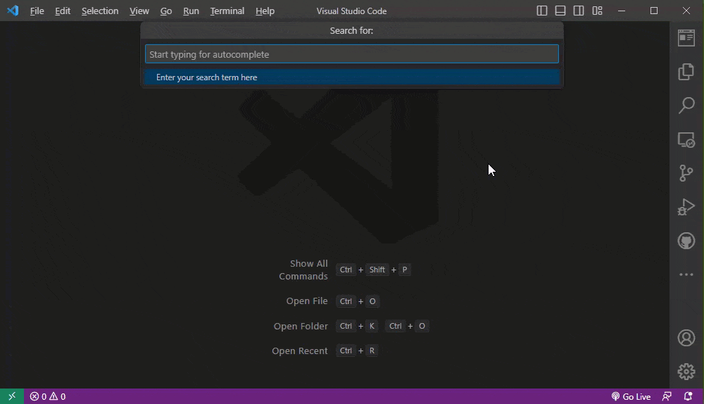
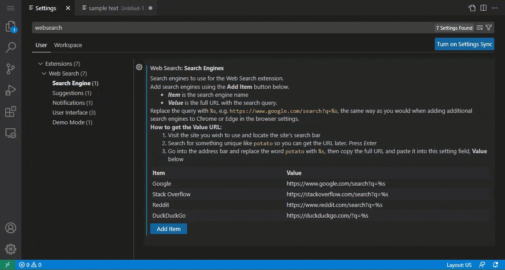
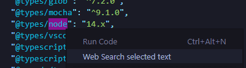

# Web Search 🔎

This extension allows you to search the web in your favorite search engines / websites (editable in extension settings), getting input either from selected text or direct entry in the extension's search bar.

## Features ✨

- Add multiple search engines in the extension settings and pick from them when performing a search
- Suggests search queries as you type, using Google Autocomplete
- Easy to use and configure
- Runs on Visual Studio Code for the Web (vscode.dev)
- Keyboard shortcut to perform a quick search <kbd>Alt</kbd>+<kbd>`</kbd>
- Type a search directly using the search bar (if no text is selected, it will ask for input)
- Great for testing SEO and web development projects
- Simple and clean Command Palette and context menu entries
- Walkthrough to help you get started using the extension
- JSON snippet to help you customize your default search engines
- Full control over the extension's information and warning notification messages
- Option to allow appending your own query when performing a search using selected text
- **NEW** Option to keep the search bar open, even if it loses focus
- Lots of extension Settings for your own customizations (choose literally any website with a search feature)

## How To Use 👇

*This extension comes packaged with a walkthrough. Use it to learn how to use the extension. (run `Get Started: Open Walkthrough` from the Command Palette)*

You can utilize the extension in many different ways:

### Via Context Menu 🖱️

1. Select the text in your code to search for
2. Right click and select "Web Search selected text" from dropdown menu
3. Select the search engine you want to use (add more in the extension settings)

### Via Search Bar 🔎︎

1. Use the keyboard shortcut <kbd>Alt</kbd>+<kbd>`</kbd> or Command Palette entry of *Web Search*
2. Type in the search term you want to search for into the search bar
3. Select the search engine you want to use (add more in the extension settings)

### Via Keyboard Shortcut ⌨️

1. Select the text in your code to search for
2. Use the keyboard shortcut <kbd>Alt</kbd>+<kbd>\`</kbd> (<kbd>Alt</kbd>+<kbd>s</kbd> *on Linux*)
3. Select the search engine you want to use (add more in the extension settings)

### Via Command Palette ☰

1. Select the text in your code to search for
2. Open the Command Palette and select the "Web Search" item from the dropdown menu
3. Select the search engine you want to use (add more in the extension settings)

## Extension Settings ⚙️

### `webSearch.searchEngines`

Search engines to use for the Web Search extension. Replace the query with `%s`, e.g. `https://www.google.com/search?q=%s`, the same way as you would when adding additional search engines to Chrome's settings.

Use the extension settings to manage the search engines easily by pressing the **Add Item** button (shown below).

#### How to get Your Own Search Engine URLs:

1. Visit the site you wish to use and locate the site's search bar
2. Search for something unique like `potato` so you can get the URL later. Press *Enter*
3. Go into the address bar and replace the word `potato` with `%s`, then copy the full URL and paste it into the setting **Value** field

#### Search Engine Examples

Want to search for the selected code on Stack Overflow?

* *Set it to `https://stackoverflow.com/search?q=%s`*

Want to search for the selected code on GitHub?

* *Set it to `https://github.com/search?q=%s`*

Want to search for the selected code definition on Microsoft Docs?

* *Set it to `https://docs.microsoft.com/en-us/search/?terms=%s&category=Reference&scope=.NET`*

Want to run the selected URL on Google's PageSpeed Insights for search engine optimization testing?

* *Set it to `https://pagespeed.web.dev/report?url=%s`*

### `webSearch.enableContextMenu`

Allows the user to enable or disable the right click context menu. Set to `true` to enable, `false` to disable.

### `webSearch.allowManualSearch`

Enable the extension to run when no text is selected, asking the user to enter a search query manually. Set to `true` to enable, `false` to disable.

### `webSearch.defaultSearchEngines`

Default search engines to use for the Web Search extension - essentially Demo Mode (*the extension's walkthrough will help you through this*). If you want to use your own, disable the new checkbox `webSearch.useDefaultSearchEnginesList`

### `webSearch.useDefaultSearchEnginesList`

Enable the Web Search extension to use default values. Disabling this will favor your own custom search engines list entered in `webSearch.searchEngines`.

### `webSearch.messageLevels`

Allows the user to control the levels of message output from the extension.

### `webSearch.allowSuggestions`

Adds support for Google suggestions / autocomplete for the extension. Start typing your search query and it will suggest queries.

### `webSearch.addToSelectedText`

When using the extension with selected text, this setting will allow you to elaborate on the selected text before performing the search. If this setting is enabled, the search bar will prompt for additional content to append to the end of the query.

### `webSearch.keepSearchBarOpen`

When using the extension, this setting will keep the extension active (persistent), even if focus is lost from the search bar or search engine selection dropdown. This can be useful if you wish to copy multiple parts of code to perform a search, or are referencing different sections. *Set to true to enable.*

## Future Development Ideas and To-dos 📝

- If selected text is a URL, open it directly or run it through PageSpeed Insights
- Add new setting to allow custom search icons on site list, or turn icons off
- Examine performance analysis of code to find potential optimizations
- Add setting to allow the search results screen to be persistent too
- Incorporate some of the API for OpenAI ChatGPT into the extension
- Add `webSearch.addToSelectedText` to the extension's walkthrough?
- Add `webSearch.keepSearchBarOpen` to the extension's walkthrough?
- Add ability to run extension from selected text in the terminal
- Add support for more autocomplete search engine sources
- Code a new setting to control user-defined search verbs
- Translate the extension to other languages
- Open search results in sidebar (webview)

> ➕ Have a feature you'd like me to implement? [Submit a feature request on the Repo's Issues page](https://github.com/BenRogersWPG/WebSearch/issues)!

## Completed To-dos ✔️

- ~~Re-organize UI setting subcategory with new subcategory for something specifically for search functions~~
- ~~Display information message when searching directly (only 1 search engine), inviting user to add more~~
- ~~Add second command to the extension of just "Web Search" as not all searches are of selected text~~
- ~~Take new setting that keeps the search bar to persist even when losing focus out of beta~~
- ~~Convert search engine settings to an array, allowing multiple search engines to be used~~
- ~~Enable extension to run on all UI elements (currently only works on Text Editor UI)~~
- ~~Review when clauses in package.json as upcoming changes were noted in VS Code v1.76~~
- ~~Try making the new `WebSearch.webSearch` command the default key command on Linux~~
- ~~Add icons to the QuickPick menu and display them on the search engine submenu~~
- ~~Use only one search engine (no submenu) if only one search engine is in settings~~
- ~~Add a submenu to the function and allow multiple websites to be searched from~~
- ~~Show message to user if they added a search engine that doesn't have a query~~
- ~~If no text selected, running the extension will prompt for text to search for~~
- ~~Replace the search bar step image on the walkthrough to show autocomplete~~
- ~~Add option to add manual text to selected text when performing a search~~
- ~~Phase out old webSearch.searchEngine setting (use deprecationMessage)~~
- ~~Replace screenshots of search bar with new Google suggestion offerings~~
- ~~Use JSON pattern restriction for search engines setting to validate URLs~~
- ~~Add new setting that will keep the search bar open after it loses focus~~
- ~~Take new setting to allow elaborating on selected text out of beta~~
- ~~Rework extension settings to better allow removing/editing entries~~
- ~~Add setting toggle to enable/disable search if submenu dismissed~~
- ~~Display search query in QuickPick URL (maybe, might be too long)~~
- ~~Add screenshot of new extension settings search engine manager~~
- ~~Remove duplicated release notes and consolidate in Changelog~~
- ~~Write a step-by-step guide for how to get search engine URLs~~
- ~~Use native browser opening to prevent external URL prompts~~
- ~~Add setting to disable information messages when searching~~
- ~~Allow a preferred default search engine to be set in settings~~
- ~~Ensure keybinding works properly on all operating systems~~
- ~~Edit QuickPick detail, or allow user to write their own detail~~
- ~~Ensure the extension uses the new LogOutputChannel API~~
- ~~Investigate adding autocomplete engine to manual entry~~
- ~~Consolidate commands into one command palette entry~~
- ~~Add `webSearch.messageLevels` step to the walkthrough~~
- ~~Update extension icon and/or add more device sizes~~
- ~~Add extension setting to toggle the right click menu~~
- ~~Show search engine name in the Command Palette~~
- ~~Add more default search engines for the extension~~
- ~~Decide on updating brace formatting preferences~~
- ~~Add GIF animation to show how extension works~~
- ~~Enable extension to run on VS Code for the web~~
- ~~Streamline extension by reducing dependencies~~
- ~~Add more GIFs to demo the extension usage~~
- ~~Add monitors for code dependency changes~~
- ~~Enforce that search engines begin with http*~~
- ~~Update search bar walkthrough screenshots~~
- ~~If no search engine is selected, do nothing~~
- ~~Add keyboard shortcuts to perform search~~
- ~~Add more screenshots of extension usage~~
- ~~Use default query if no query is provided~~
- ~~Improve validation of search URL checks~~
- ~~Add screenshots of the new settings~~
- ~~Move images to consolidated folder~~
- ~~Add autocomplete to walkthrough~~
- ~~Perform additional code cleanup~~
- ~~Perform more code refactoring~~
- ~~Take autocomplete out of beta~~
- ~~Add license to the project~~
- ~~Fix unit test system~~
- ~~Write more tests~~

## Waiting on API Updates ⌛

- Add links from extension settings mentioning other settings without affecting walkthrough button links
- Remove "selected text" from command palette entry title without adding a new command
- Add dynamic sub context menu to right click menu containing all search engines
- Use variables in setting descriptions, so that the keybindings are dynamic
- Move cursor to the end of the search bar when using selected text
- Add tooltips to quickpick items (noted in VS Code v1.76)

## Requirements 📦

- Visual Studio Code or Visual Studio Code for the Web running on any operating system
- Will work with Visual Studio Code 1.100.2 or later (more recent)

## Known Issues 🐛

- Searching on Stack Overflow sometimes requires a CAPTCHA. Either log in or accept cookies to prevent this.
- If using VS Code for Web, you may receive popups asking "Do you want Code to open the external website?". To have URLs open immediately, follow these quick and easy steps:
    1. On the popup that appears, click the *Configure Trusted Domains Button*
    2. Select the level of trust you wish to give to the website.
    3. The next time you perform searches on that search engine's website, it will just open without prompting you.

## Sponsor This Project ❤️

I spend a lot of time improving and maintaining this extension. If you'd like to sponsor this project, please visit [my GitHub Sponsor page](https://github.com/sponsors/BenRogersWPG/) to learn more.

*One of the perks of being a sponsor is that you will even show up on this very README page!*

## Release Notes 🆕

See [CHANGELOG](https://github.com/BenRogersWPG/WebSearch/blob/master/CHANGELOG.md) file.

## Software Details 💿

* **Author:** Ben Rogers
* **Date Published:** 4/19/2022, 10:10:14 AM
* **Publisher:** Ben Rogers
* **Software Version:** 6.12.1
* **Last Updated:** 9/11/2025, 9:36:00 PM
* **Average Rating:** 5.0
* **Rating Count:** 1
* **Category:** DeveloperApplication
* **Unique Identifier:** BenRogersWPG.websearchengine
* **Install URL:** [https://marketplace.visualstudio.com/items?itemName=BenRogersWPG.websearchengine](https://marketplace.visualstudio.com/items?itemName=BenRogersWPG.websearchengine)
* **Project URL:** [https://github.com/BenRogersWPG/WebSearch](https://github.com/BenRogersWPG/WebSearch)

<!-- JSON-LD markup generated by Google Structured Data Markup Helper. -->
