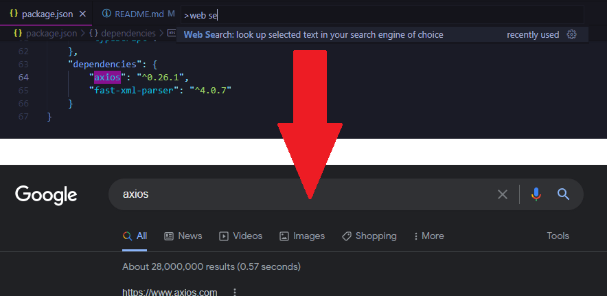
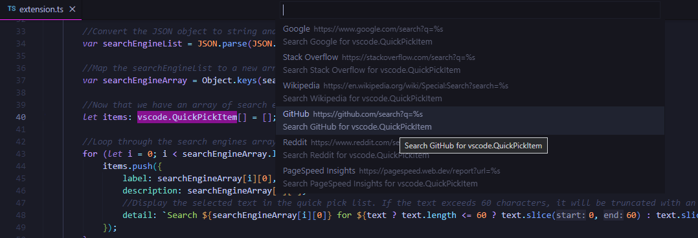
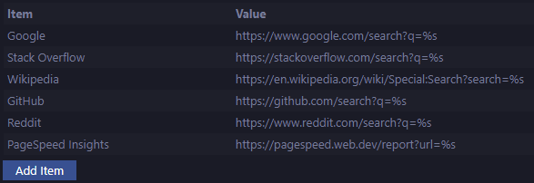

# Web Search 🔎

This extension allows you to search the web in your favorite search engines / websites (editable in extension settings), getting input either from selected text or direct entry in the extension's search bar.



## Features ✨

- Add multiple search engines in the extension settings and pick from them when performing a search
- Easy to use and configure
- Runs on Visual Studio Code for the Web (vscode.dev)
- **NEW** Type a search manually (no longer requires you to select the text first) into the search bar
- Keyboard shortcut to perform a quick search ```Alt + ` ``` 
- Simple and clean Command Pallete and context menu entries
- Great for testing SEO and web development projects
- Extension Settings for your own customizations (choose literally any website with a search feature)


## How To Use 👇

To utilize the extension:

### Via Context Menu 🖱️

1. Select the text in your code to search for
2. Right click and select "Web Search" from dropdown menu
3. Select the search engine you want to use (add more in the extension settings)

### Via Search Bar 🆕

1. Use the keyboard shortcut ```Alt + ` ``` or Command Palette entry of Web Search
2. Type in the search term you want to search for into the search bar
3. Select the search engine you want to use (add more in the extension settings)

### Via Keyboard Shortcut ⌨️

1. Select the text in your code to search for
2. Use the keyboard shortcut ```Alt + ` ``` 
3. Select the search engine you want to use (add more in the extension settings)

### Via Command Pallete ☰

1. Select the text in your code to search for
2. Open the Command Palette and select the "Web Search" item from the dropdown menu
3. Select the search engine you want to use (add more in the extension settings)



## Extension Settings ⚙️

### `webSearch.searchEngines`

Search engines to use for the Web Search extension. Replace the query with `%s`, e.g. `https://www.google.com/search?q=%s`, the same way as you would when adding additional search engines to Chrome's settings. Add multiple search engines as key value pairs, e.g. `{ "Google": "https://www.google.com/search?q=%s", "Bing": "https://www.bing.com/search?q=%s" }`, or use the extension settings GUI to manage the search engines easily.



#### Search Engine Examples

Want to search for the selected code on Stack Overflow?

*Set it to `https://stackoverflow.com/search?q=%s`*

Want to search for the selected code on GitHub?

*Set it to `https://github.com/search?q=%s`*

Want to search for the selected code definition on Microsoft Docs?

*Set it to `https://docs.microsoft.com/en-us/search/?terms=%s&category=Reference&scope=.NET`*

Want to run the selected URL on Google's PageSpeed Insights for SEO testing?

*Set it to `https://pagespeed.web.dev/report?url=%s`*

### `webSearch.enableContextMenu`

Allows the user to enable or disable the right click context menu. Set to `true` to enable, `false` to disable.


### `webSearch.allowManualSearch`

Enable the extension to run when no text is selected, asking the user to enter a search query manually. Set to `true` to enable, `false` to disable.

### `webSearch.searchEngine`

**DEPRECIATED** Single search engine to use for the Web Search extension.
Replaced by `webSearch.searchEngines`, allowing you to add multiple search engines.
*Will be removed in future version some time.*

## Future Development Ideas and To-dos 📝

- Examine performance analysis of code to find potential optimizations
- Poll site favicons and display them on the search engine submenu
- Add setting toggle to use only one search engine, no submenu
- Add setting to disable information messages when searching
- Allow a preferred default search engine to be set in settings
- Investigate adding autocomplete engine to manual entry
- Streamline extension by reducing dependancies 
- Phase out old webSearch.searchEngine setting
- Add more GIFs to demo the extension usage
- Translate the extension to other languages
- Perform additional code cleanup
- Write more tests

## Completed To-dos ✔️

- ~~Convert search engine settings to an array, allowing multiple search engines to be used~~
- ~~Enable extension to run on all UI elements (currently only works on Text Editor UI)~~
- ~~Add a submenu to the function and allow multiple websites to be searched from~~
- ~~Show message to user if they added a search engine that doesn't have a query~~
- ~~If no text selected, running the extension will prompt for text to search for~~
- ~~Display search query in QuickPick URL (maybe, might be too long)~~
- ~~Add screenshot of new extension settings search engine manager~~
- ~~Add setting toggle to enable/disable search if submenu dismissed~~
- ~~Remove duplicated release notes and consolidate in Changelog~~
- ~~Edit QuickPick detail, or allow user to write their own detail~~
- ~~Consolidate commands into one command palette entry~~
- ~~Update extension icon and/or add more device sizes~~
- ~~Add extension setting to toggle the right click menu~~
- ~~Add more default search engines for the extension~~
- ~~Show search engine name in the Command Palette~~
- ~~Decide on updating brace formatting preferences~~
- ~~Add GIF animation to show how extension works~~
- ~~Enable extension to run on VS Code for the web~~
- ~~Add monitors for code dependency changes~~
- ~~If no search engine is selected, do nothing~~
- ~~Add keyboard shortcuts to perform search~~
- ~~Add more screenshots of extension usage~~
- ~~Use default query if no query is provided~~
- ~~Move images to consolidated folder~~
- ~~Add screenshots of the new settings~~
- ~~Perform more code refactoring~~
- ~~Add license to the project~~

## Waiting on API Updates ⌛

- Add dynamic sub context menu to right click menu containing all search engines

## Requirements 📦

N/A

## Known Issues 🐛

N/A

## Release Notes 🆕

See [CHANGELOG](https://github.com/BenRogersWPG/WebSearch/blob/master/CHANGELOG.md) file.