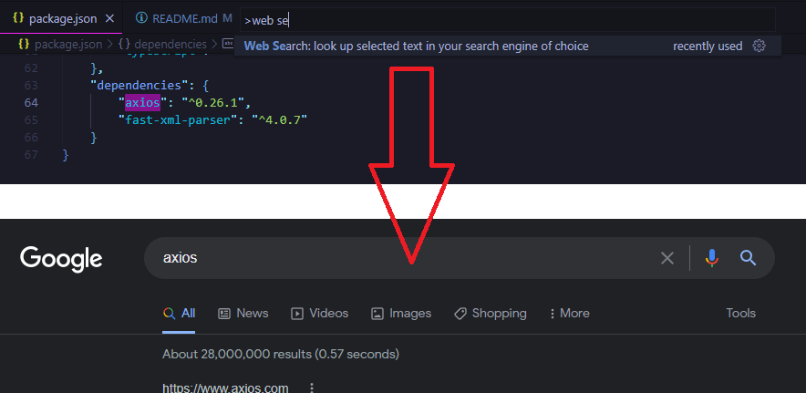
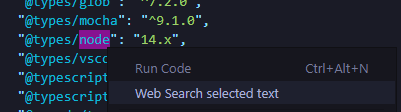

# Web Search

This extension allows you to search for the selected text and perform a web search in your favorite search engines / websites (editable in extension settings).

## Features

- Add multiple search engines in the extension settings and pick from them when performing a search
- Extension Settings for your own customizations (choose literally any website with a search feature)
- Available as a right click menu for easy access
- Simple and clean Command Pallete entry
- Easy to use and configure
- **NEW** Runs on Visual Studio Code for the Web (vscode.dev)

## How To Use

To utilize the extension:

### Via Context Menu

1. Select the text in your code to search for
2. Right click and select "Web Search" from dropdown menu
3. Select the search engine you want to use (add more in the extension settings)

### Via Command Pallete

1. Select the text in your code to search for
2. Open the Command Palette and select the "Web Search" item from the dropdown menu
3. Select the search engine you want to use (add more in the extension settings)

## Extension Settings

### `webSearch.searchEngines`

Search engines to use for the Web Search extension. Replace the query with `%s`, e.g. `https://www.google.com/search?q=%s`, the same way as you would when adding additional search engines to Chrome's settings. Add multiple search engines as key value pairs, e.g. `{ "Google": "https://www.google.com/search?q=%s", "Bing": "https://www.bing.com/search?q=%s" }`, or use the extension settings GUI to manage the search engines easily.

*Default Values:*
    `"Google": "https://www.google.com/search?q=%s",`
    `"Stack Overflow": "https://stackoverflow.com/search?q=%s",`
    `"Wikipedia": "https://en.wikipedia.org/wiki/Special:Search?search=%s",`
    `"GitHub": "https://github.com/search?q=%s",`
    `"Reddit": "https://www.reddit.com/search?q=%s"`

#### Search Engine Examples

Want to search for the selected code on Stack Overflow?

*Set it to `https://stackoverflow.com/search?q=%s`*

Want to search for the selected code on GitHub?

*Set it to `https://github.com/search?q=%s`*

Want to search for the selected code definition on Microsoft Docs?

*Set it to `https://docs.microsoft.com/en-us/search/?terms=%s&category=Reference&scope=.NET`*

### `webSearch.enableContextMenu`

Allows the user to enable or disable the right click context menu. Set to `true` to enable, `false` to disable.

*Default Value:*
`true`

### `webSearch.searchEngine`

**DEPRECIATED** Single search engine to use for the Web Search extension.
Replaced by `webSearch.searchEngines`, allowing you to add multiple search engines.
*Will be removed in future version some time.*

*Default Value:*
`https://www.google.com/search?q=%s`

## Requirements

N/A

## Known Issues

N/A

## Future Development Ideas and To-dos

- Enable extension to run on all UI elements (currently only works on Text Editor UI)
- Show message to user if they added a search engine that doesn't have a query
- Examine performance analysis of code to find potential optimizations
- Display search query in QuickPick URL (maybe, might be too long)
- Add screenshot of new extension settings search engine manager
- Add setting toggle to use only one search engine, no submenu
- Allow a preferred default search engine to be set in settings
- Edit QuickPick detail, or allow user to write their own detail
- Update extension icon and/or add more device sizes
- Add GIF animation to show how extension works
- Decide on updating brace formatting preferences
- Phase out old webSearch.searchEngine setting
- Translate the extension to other languages
- Add keyboard shortcuts to perform search
- Add more screenshots of extension usage
- Add screenshots of the new settings
- Move images to consolidated folder
- Write more tests

## Completed Tasks

- ~~Convert search engine settings to an array, allowing multiple search engines to be used~~
- ~~Add a submenu to the function and allow multiple websites to be searched from~~
- ~~Remove duplicated release notes and consolidate in Changelog~~
- ~~Add extension setting to toggle the right click menu~~
- ~~Show search engine name in the Command Palette~~
- ~~Add more default search engines for the extension~~
- ~~Enable extension to run on VS Code for the web~~
- ~~Add monitors for code dependency changes~~
- ~~Use default query if no query is provided~~
- ~~Perform more code refactoring~~
- ~~Add license to the project~~

## Waiting on API Updates
- Add dynamic sub context menu to right click menu containing all search engines

## Release Notes

See [CHANGELOG](https://github.com/BenRogersWPG/WebSearch/blob/master/CHANGELOG.md) file.